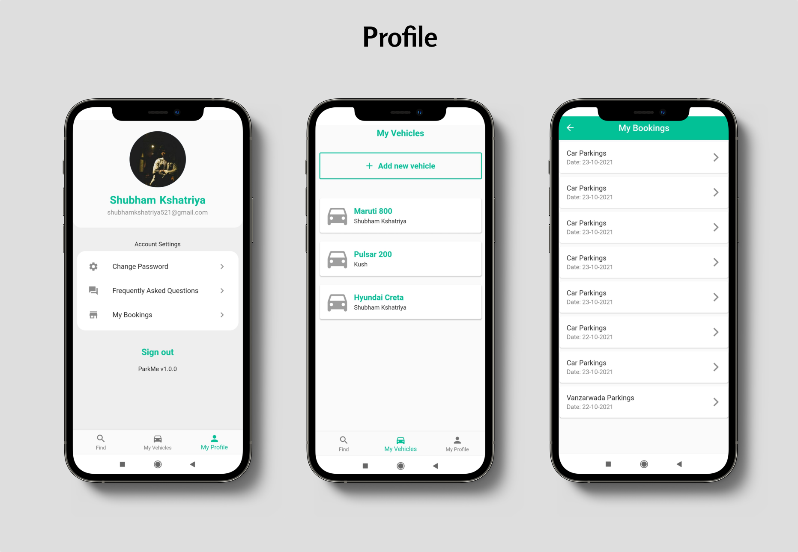

## **Park ME** allows a user to:
* find nearby parking spots based on their live location.
* search for parking spots in any region.
* book a parking spot for a particular span of time.
* pay for the parking online using an in-built payment gateway or on arrival.
* keep a track of all booked parking at one place.

Moreover, the app will also send a SMS to the user on successful parking reservation.

## Tools and Technologies:
Flutter | Firebase | Firestore | Google Maps API | RazorPay API | Twilio API

## App Interface:

